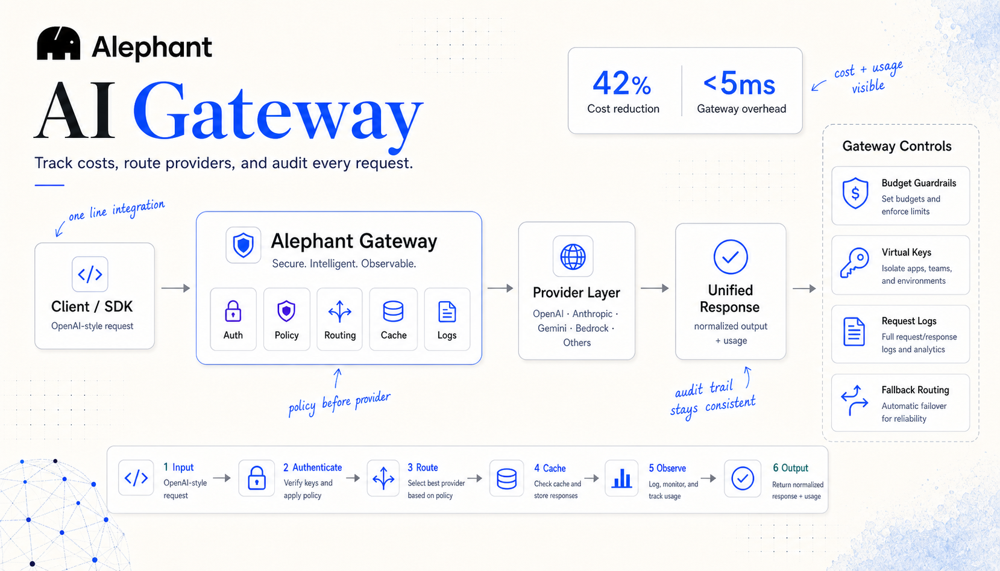
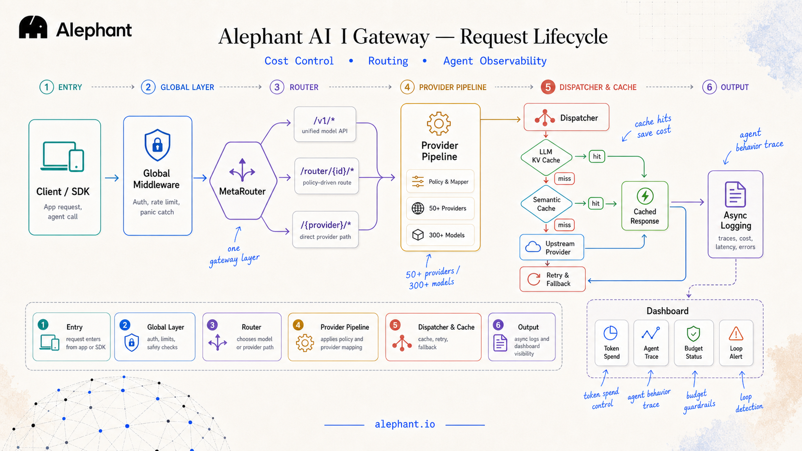
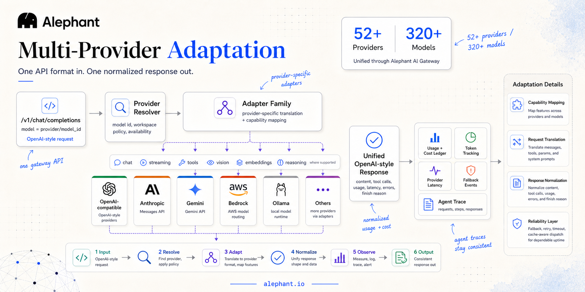
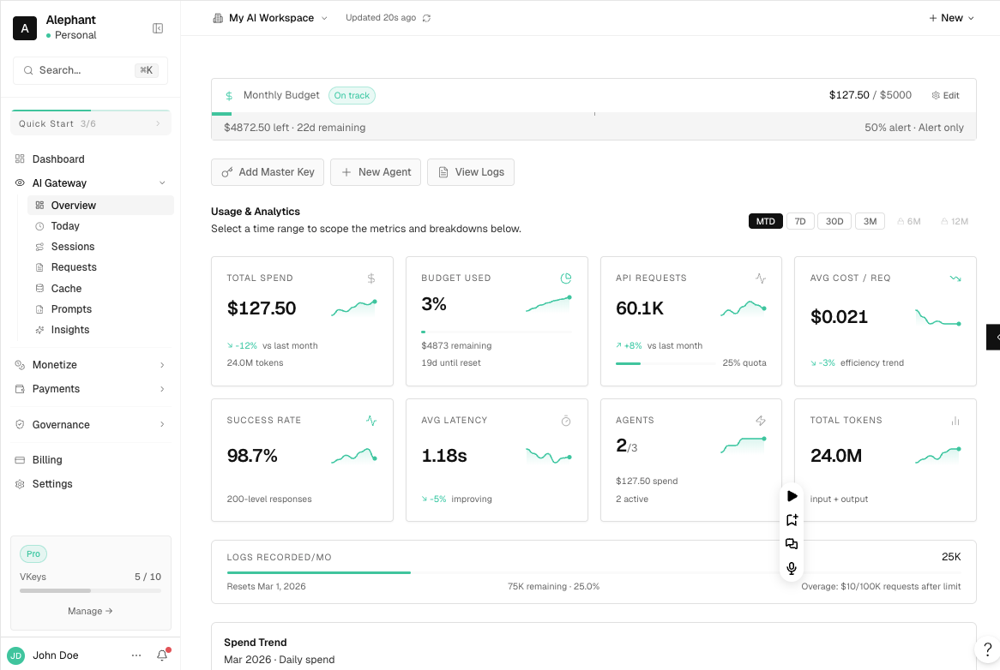
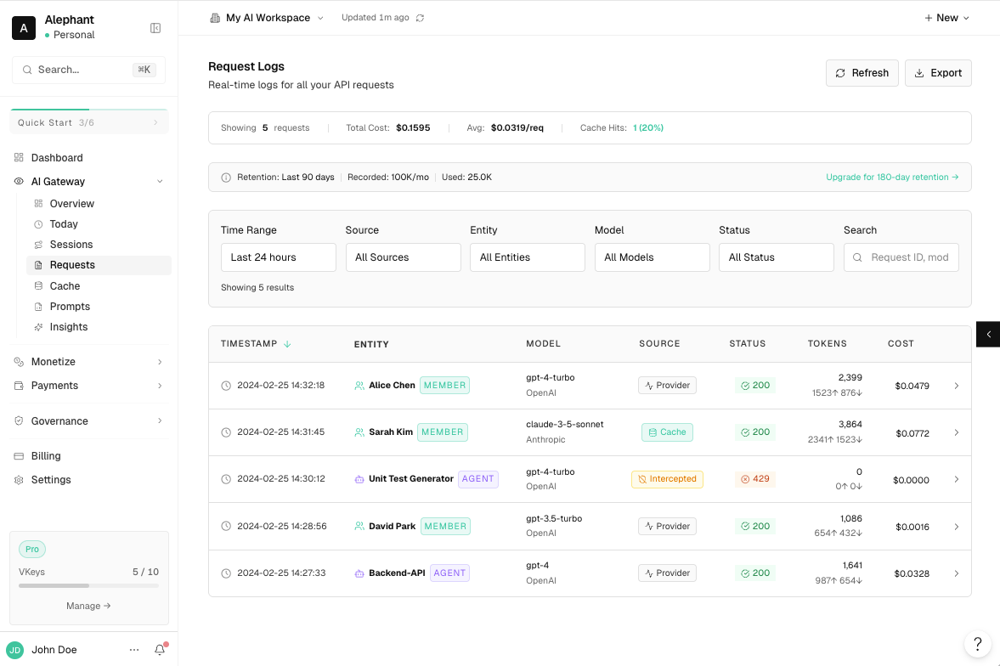
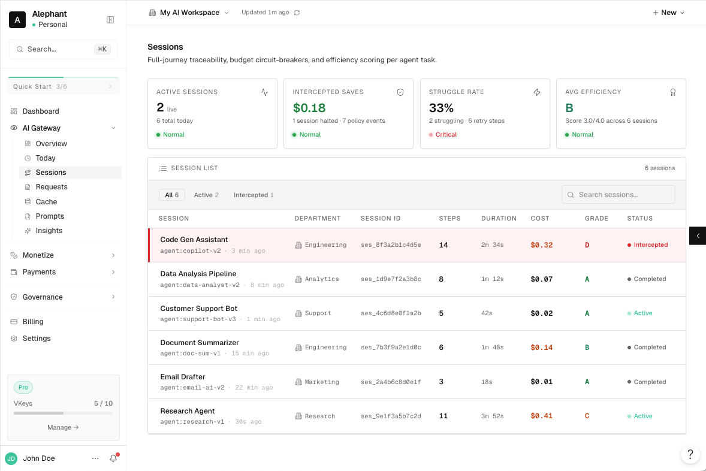
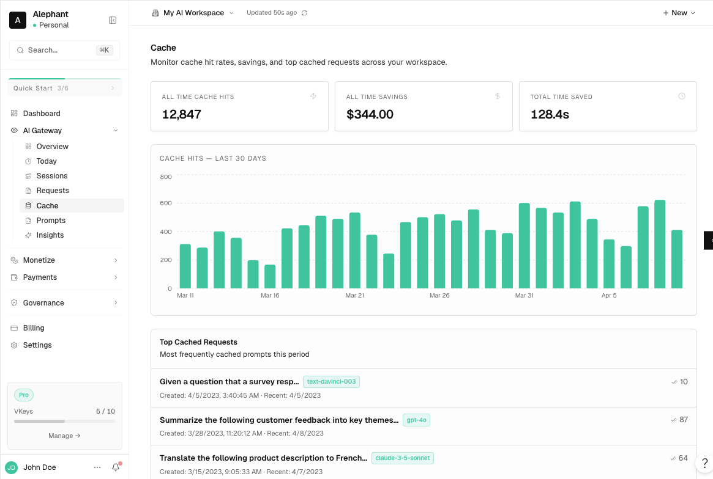
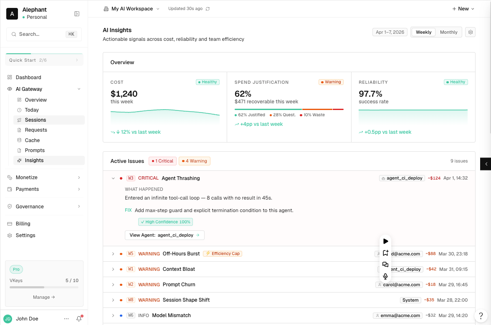
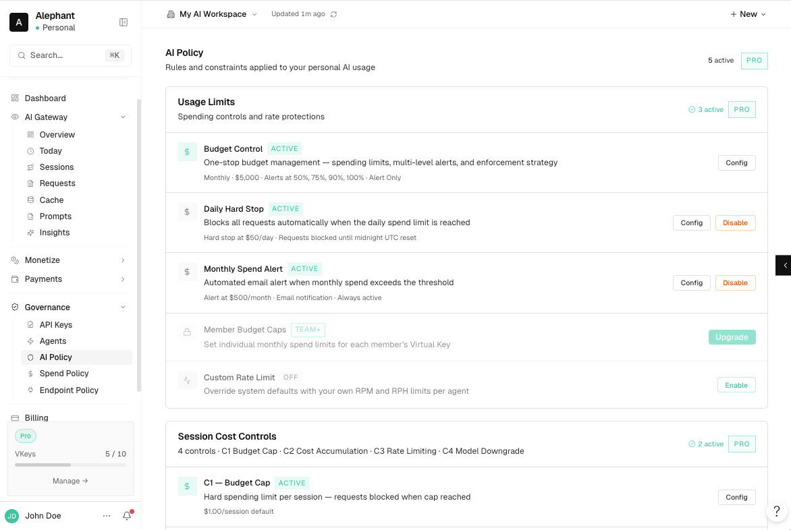

<h1 align="center">
  
  Alephant AI Gateway
</h1>

<p align="center">
  <strong>开源、兼容 OpenAI 的 AI 网关：支持 50+ 家提供商、320+ 款模型及自定义模型后端。</strong><br />
  在一个对开发者友好的接入点上完成流量路由、提供商 API 适配、响应缓存、策略执行与全链路观测。
</p>

<p align="center">
  <a href="LICENSE"></a>
  
  
  
  
  
</p>

<p align="center">
  <a href="https://x.com/alephantai" rel="noopener noreferrer" target="_blank"></a>
  <a href="https://discord.gg/tRQghcXhaH" rel="noopener noreferrer" target="_blank"></a>
  <a href="https://t.me/alephantai" rel="noopener noreferrer" target="_blank"></a>
</p>

<p align="center">
  
  
  
  
</p>

<p align="center">
  
</p>

<p align="center">
  <a href="#quickstart">快速开始</a> ·
  <a href="https://alephant.io/">官网</a> ·
  <a href="#features">功能</a> ·
  <a href="#architecture">架构</a> ·
  <a href="#screenshots">截图</a> ·
  <a href="#comparison">对比</a> ·
  <a href="#community">社区</a> ·
  <a href="https://api.alephant.io/">文档</a>
</p>

<p align="center">
  <a href="https://alephant.io/"><b>开始使用 →</b></a> ·
  <a href="README.md">English</a>
</p>

## 什么是 Alephant AI Gateway

Alephant AI Gateway 是面向生产级 AI 应用的 OpenAI 兼容控制层，既可作为托管 SaaS（Alephant Cloud）使用，也可自托管网关。开发者只需对接一套稳定的 API，由网关负责各家提供商的适配、模型路由、策略执行、分层缓存、重试与回退、用量元数据、请求日志与审计轨迹。

应用无需再逐个直连各家提供商；团队一次接入，即可在 50+ 提供商、320+ 模型与自定义后端之间路由。可从 Alephant Cloud 托管工作区起步；若需要私有基础设施、自带密钥（BYO keys）与直接运维控制，则自托管网关。

```typescript
import OpenAI from "openai"

const openai = new OpenAI({
  baseURL: "https://ai.alephant.io/v1",
  defaultHeaders: {
    Authorization: `Bearer ${process.env.ALEPHANT_API_KEY}`,
    "Alephant-Session-Id": "session-xxx", // 可选
  }
})
```

## 项目状态

Alephant AI Gateway 当前处于 beta（`0.2.0-beta.30`）。Alephant Cloud 为托管 SaaS 路径；本仓库提供用于自托管及与平台对接部署的网关运行时。在稳定版 `1.0` 发布前，公开 API、配置项与内部构建模式仍可能演进。

---

## 为什么需要它

AI 应用正从单模型原型走向会调用多家提供商、Agent、工具与自定义后端的生产系统。没有网关时，每个团队都会重复搭建同一套运维层：提供商适配、路由规则、密钥管理、用量元数据、重试、缓存与请求日志。

Alephant AI Gateway 将上述能力收敛到一套 OpenAI 兼容 API 之后：开发者获得稳定的集成面；平台团队在访问上游前可做策略、在重复调用前可缓存、在故障前可回退、在事故前可留审计。

目标很简单：让 AI 流量可观测、可治理、可依赖，同时尽量不拖慢开发者。[了解更多 →](https://alephant.io/)

<a id="features"></a>

## 功能

| 能力 | Alephant AI Gateway 提供 |
| --- | --- |
| 单一 API 面 | OpenAI 兼容的 `/v1/*` 与 `/ai/*` 路由：对话、responses、嵌入、图像及提供商风格的模型名 |
| 提供商与模型覆盖 | 50+ 提供商、320+ 模型、本地运行时、OpenRouter 式目录与自定义/私有后端 |
| 提供商适配 | 跨各家 API 统一请求、工具、流式、错误、用量、结束原因与响应形态 |
| 路由与韧性 | 直连路径、策略路由器、重试、回退、健康检查、提供商 429 处理与失败放行缓存路径 |
| Agent 客户端兼容 | 面向 Cursor、Codex、opencode、Antigravity 等流程的 OpenAI 兼容格式 |
| 策略与密钥控制 | 虚拟密钥、主密钥解析、模型策略、工作区提供商白名单与并发控制 |
| 缓存 | 网关侧 LLM KV 缓存与语义缓存，减少重复上游调用 |
| 可观测性 | 请求日志、链路、指标、用量元数据、可选正文归档与下游日志投递 |
| 在线运维 | 路由、虚拟密钥与提供商密钥随数据库变更刷新，无需重启网关 |
| 部署 | 通过 Alephant Cloud 托管 SaaS，或自托管 Rust 网关并对接 PostgreSQL、Redis、Qdrant 与 S3 兼容存储 |

## 开发者接口

| 接口 | 用途 |
| --- | --- |
| `/v1/*` | 现有 SDK 与 Agent 客户端可无缝接入的 OpenAI 兼容 API |
| `/router/{id}/*` | 经配置路由器进行的策略驱动路由 |
| `/{provider}/*` | 需要显式控制上游时的直连提供商透传 |
| `model=provider/model_id` | 不改应用代码即可选择提供商与模型 |
| 自定义后端 | 将私有模型或自托管运行时挂在同一网关契约下 |

<h2 id="architecture">架构与请求生命周期</h2>

<p align="center">
  
</p>

每个请求都经过同一套网关生命周期：全局中间件、路由、提供商映射、派发、缓存、回退与异步日志。入口路径取决于你希望的控制粒度：

| 路径 | 适用场景 |
| --- | --- |
| `/v1/*` | 统一 OpenAI 风格访问，配合 `model=provider/model_id` |
| `/router/{id}/*` | 经配置路由器的策略驱动路由 |
| `/{provider}/*` | 需要显式指定上游时的直连提供商透传 |

## 多提供商适配

同一套 OpenAI 风格请求可覆盖 50+ 提供商与 320+ 模型，包括 OpenAI 兼容 API、Anthropic Messages、Gemini、Bedrock、Ollama、OpenRouter 式目录与自定义后端。客户端通过 `model=provider/model_id` 选择运行时；Alephant 解析提供商、应用对应适配器、映射各家专有字段，并返回归一化的 OpenAI 风格响应。

README 不枚举全部模型，本节强调契约：**一种请求进，一种一致响应出**。提供商与模型目录可独立演进，无需强制改应用代码。

<p align="center">
  
</p>

<blockquote>
  <table>
    <tr>
      <td><strong>主流模型</strong></td>
      <td>GPT-4o · GPT-4.1 · o3 · Claude 3.5/3.7 Sonnet · Claude Opus · Gemini 1.5/2.0 · Llama 3/4 · Mistral Large · Command R+</td>
    </tr>
    <tr>
      <td><strong>提供商生态</strong></td>
      <td>OpenAI · Anthropic · Google Gemini · AWS Bedrock · Azure OpenAI · OpenRouter · Together AI · Fireworks · Groq · Cohere · Mistral · Perplexity · DeepSeek · xAI · Ollama</td>
    </tr>
    <tr>
      <td><strong>Agent 客户端兼容</strong></td>
      <td>Cursor · Codex · opencode · Antigravity</td>
    </tr>
  </table>
</blockquote>

<a id="quickstart"></a>

## 快速开始

### 使用 Alephant Cloud（托管 SaaS）

继续使用现有 OpenAI SDK，只需修改 base URL 与鉴权头。应用仍用熟悉的 OpenAI 风格调用，由 Alephant Cloud 提供托管工作区、网关端点、提供商解析、路由、缓存、日志与回退。

设置网关密钥：

```bash
export ALEPHANT_API_KEY="vk-..."
```

使用 `curl` 冒烟测试：

```bash
curl https://ai.alephant.io/v1/chat/completions \
  -H "Authorization: Bearer $ALEPHANT_API_KEY" \
  -H "Content-Type: application/json" \
  -d '{
    "model": "openai/gpt-4o",
    "messages": [
      { "role": "user", "content": "用一句话解释 Alephant AI Gateway。" }
    ]
  }'
```

或使用 OpenAI SDK：

```typescript
import OpenAI from "openai"

const openai = new OpenAI({
  baseURL: "https://ai.alephant.io/v1",
  defaultHeaders: {
    Authorization: `Bearer ${process.env.ALEPHANT_API_KEY}`,
    "Alephant-Session-Id": "demo-session", // 可选：将请求归入同一条 trace/会话
  }
})

const response = await openai.chat.completions.create({
  model: "openai/gpt-4o",
  messages: [
    { role: "user", content: "用一句话解释 Alephant AI Gateway。" }
  ]
})

console.log(response.choices[0]?.message?.content)
```

[开始使用 →](https://alephant.io/)

## 从源码自托管

Alephant AI Gateway 可作为独立的自托管 Rust 服务运行。可将自有应用指向本地网关，对接 PostgreSQL / Redis / Qdrant / S3 兼容基础设施，并在部署侧控制提供商密钥、路由器配置、缓存行为与日志目的地。

当你需要在自有网络内运行网关、完全掌控上游凭证，或在接入 Alephant Cloud 之前验证适配与路由行为时，自托管尤为合适。

### 前置条件

| 依赖 | 是否必需 | 用途 |
| --- | --- | --- |
| Rust 工具链 | 是 | 构建与运行网关服务 |
| PostgreSQL | 是 | 路由器、密钥、工作区与运行时配置 |
| Redis | 推荐 | 共享运行时状态、并发控制与缓存相关路径 |
| Qdrant | 可选 | 语义缓存 |
| S3 兼容存储 | 可选 | 大体量请求/响应正文归档 |

构建 `ai-gateway` 时，`--features external` 与 `--features internal` **必须且仅能**启用其一。

### 构建

```bash
cargo build -p ai-gateway --features external
```

`external` 面向公开/开放部署模式；`internal` 适用于带有内部 KV/后端假设的环境。请勿同时启用两套 feature。

### 本地运行

```bash
cargo run -p ai-gateway --features external -- -c ./ai-gateway/config/local.yaml
```

配置文件控制数据库连接、提供商设置、缓存服务、可观测性与运行时行为。本地开发可从 `ai-gateway/config/local.yaml` 起步并按你的服务调整。

### 配置

网关读取 YAML 配置文件，并支持对环境敏感项使用环境变量覆盖。尽量勿将提供商密钥、S3 凭证、Redis URL 等秘密提交进 YAML。

常用起点：

| 文件 | 用途 |
| --- | --- |
| `ai-gateway/config/local.yaml` | 本地开发默认 |
| `ai-gateway/config/local-cloud.yaml` | 本地「云风格」对接 |
| `ai-gateway/config/alephant-cloud.yaml` | 与 Alephant 平台对接的部署形态 |

环境变量覆盖遵循配置加载器的 `AI_GATEWAY__...` 约定，例如 `AI_GATEWAY__S3__ACCESS_KEY`、`AI_GATEWAY__S3__SECRET_KEY`、`AI_GATEWAY__REQUEST_LOG__LOG_QUEUE_REDIS_URL`。

### 验证

保持本地网关进程运行。冒烟测试默认指向本地网关地址 `http://localhost:8080`。

```bash
cargo run -p test
```

也可将 OpenAI 兼容 SDK 指向自托管网关：

```typescript
import OpenAI from "openai"

const openai = new OpenAI({
  baseURL: "http://localhost:8080/v1",
  defaultHeaders: {
    Authorization: `Bearer ${process.env.ALEPHANT_VIRTUAL_KEY}`,
  }
})
```

### 集成测试

```bash
cargo test -p ai-gateway --tests --features "external integration"
```

## 安全与隐私

Alephant AI Gateway 同时面向托管 SaaS 与自托管场景，后者通常需要自主控制提供商凭证、请求元数据与部署边界。

| 方面 | 网关行为 |
| --- | --- |
| BYO 提供商密钥 | 可通过网关配置与密钥解析将提供商凭证保留在你的控制下 |
| 虚拟密钥隔离 | 面向应用的密钥可与上游提供商密钥分离 |
| 可选正文归档 | 请求/响应体存储可配置，而非强制 |
| SaaS 或自托管 | 使用 Alephant Cloud 托管运维，或在自有基础设施内运行网关 |
| 策略闸口 | 可在派发上游前强制执行模型策略、提供商白名单与并发控制 |

## 运行时内部机制

| 能力 | 为何重要 |
| --- | --- |
| DB 监听器驱动热重载 | 路由与密钥变更可在不重启网关的情况下生效 |
| S3 兼容正文存储 | 启用时可将请求与响应体归档在热路径之外 |
| 下游请求日志投递 | 结构化网关日志可推送至 Alephant 或其他下游系统 |
| 内容过滤集成 | 可选 gRPC 过滤路径，带失败放行重连行为 |
| 工作区并发护栏 | 基于 Redis 的控制有助于保护共享上游容量 |
| 提供商 429 监控 | 提供商限流信号可参与发现与路由决策 |

## 截图

围绕网关探索 Alephant 工作区体验：用量总览、请求日志、会话、缓存可见性、洞察与治理控制。

| 总览 | 请求日志 |
| --- | --- |
| <br /><sub>工作区级用量、请求量、延迟、token 与缓存健康度。</sub> | <br /><sub>按请求查看状态、模型、来源、token、费用与上游结果。</sub> |

| 会话 | 缓存 |
| --- | --- |
| <br /><sub>追踪 Agent 与应用在多步中的旅程、耗时、花费与状态。</sub> | <br /><sub>监控缓存命中、节省、重复 prompt 与高频复用响应。</sub> |

| 洞察 | 治理 |
| --- | --- |
| <br /><sub>从网关流量中呈现可靠性、花费与效率信号。</sub> | <br /><sub>配置用量上限、预算控制、限流与策略规则。</sub> |

<a id="comparison"></a>

## 对比

Portkey、Alephant 与 LiteLLM 都是优秀项目，但侧重点不同。Alephant 面向交付 Agent 类 AI 产品的团队：托管 SaaS 工作区 + 自托管网关路径，覆盖 Agent 开发、成本控制、提供商路由、治理与运维可见性。

| 项目 | 最广为人知 | 最适合 |
| --- | --- | --- |
| Portkey | 企业级 AI 网关控制、护栏与托管策略工作流 | 需要托管 AI 控制面的团队 |
| Alephant | LLM 可观测性、请求分析、会话与成本可见性 | 首要需求是追踪与分析的团队 |
| LiteLLM | 广泛的 Python 代理/SDK 生态覆盖多家提供商 | 希望通过 Python 栈获得最大提供商覆盖的团队 |
| Alephant AI Gateway | Agent 开发基础设施、成本控制、治理、提供商路由及 SaaS + 自托管部署 | 需要成本护栏、请求可追溯、BYO 密钥与多提供商管控的生产级 Agent 团队 |

| 能力 | Portkey | Alephant | LiteLLM | Alephant AI Gateway |
| --- | --- | --- | --- | --- |
| OpenAI 兼容 API | 是 | 是 | 是 | 是 |
| SaaS + 自托管 | 企业/自托管选项 | 托管与自托管选项 | 自托管代理 | 是：Alephant Cloud + 自托管 Rust 网关 |
| 提供商/模型覆盖 | 广 | 广（日志/代理覆盖） | 很广 | 50+ 提供商、320+ 模型、自定义后端 |
| Agent 编程客户端 | 无专门兼容层 | 无专门兼容层 | 无专门兼容层 | Cursor、Codex、opencode、Antigravity 工作流 |
| Agent 成本控制 | 护栏与策略控制 | 成本分析与请求可见性 | 预算与花费控制 | Agent/会话感知用量可见性、缓存节省、预算控制与治理工作流 |
| 提供商适配 | 网关策略与路由 | 代理 + 可观测流水线 | 强提供商抽象 | 针对请求、流式、错误、用量与响应的显式映射 |
| 路由与韧性 | 路由、重试、回退 | 网关控制 + 可观测性 | 路由器、回退、预算 | 直连路径、策略路由器、回退、健康检查、提供商 429 处理 |
| BYO 密钥控制 | 密钥保管 / 企业控制 | BYO 密钥与代理控制 | 虚拟密钥与自托管密钥 | BYO 提供商密钥、主密钥解析、工作区白名单 |
| 缓存 | 网关缓存 | 缓存追踪/集成 | 缓存集成 | LLM KV 缓存 + 语义缓存 |
| 可观测性 | 日志与策略事件 | 核心强项 | 回调/日志集成 | 日志、链路、指标、用量元数据、可选正文归档 |
| 治理路径 | 强企业护栏 | 围绕可观测性的工作区控制 | 团队、预算、限流 | Agent/会话治理、模型策略、提供商白名单、并发控制与工作区级控制 |

Alephant 的差异化在于组合：托管 SaaS、自托管 Rust 网关、Agent 优先的开发者兼容、成本控制工作流、BYO 密钥治理、显式提供商适配与工作区级 AI FinOps。

## 仓库结构

```text
alephant-ai-gateway/
├── ai-gateway/                 # 网关服务 crate
├── crates/                     # 共享库与 harness
├── docs/                       # 仓库内说明；精选文档见 https://api.alephant.io/
├── scripts/                    # CI 与本地自动化
├── infrastructure/             # 部署与可观测性基础设施
├── test/                       # 集成与运行时测试辅助
├── AGENTS.md                   # Agent 协作约定
├── CLAUDE.md                   # 命令与架构参考
└── CHANGELOG.md                # 项目变更日志
```

<a id="community"></a>

## 社区

- 官网：[alephant.io](https://alephant.io/)
- 文档：[api.alephant.io](https://api.alephant.io/)
- Discord：[discord.gg/tRQghcXhaH](https://discord.gg/tRQghcXhaH)
- Telegram：[t.me/alephantai](https://t.me/alephantai)
- X：[x.com/alephantai](https://x.com/alephantai)

## 贡献

欢迎通过 issue 与 pull request 参与贡献。

有价值的贡献方向：

- 提供商适配器正确性与 API 映射。
- 路由、回退与韧性行为。
- 可观测性与诊断质量。
- 测试 harness 覆盖与文档清晰度。

若为较大改动，请附上可复现的验证步骤与 feature flag 上下文（`external` 或 `internal`）。

## 许可

基于 [GPL License 3.0](LICENSE) 授权。
在适用情况下保留上游许可连续性。
